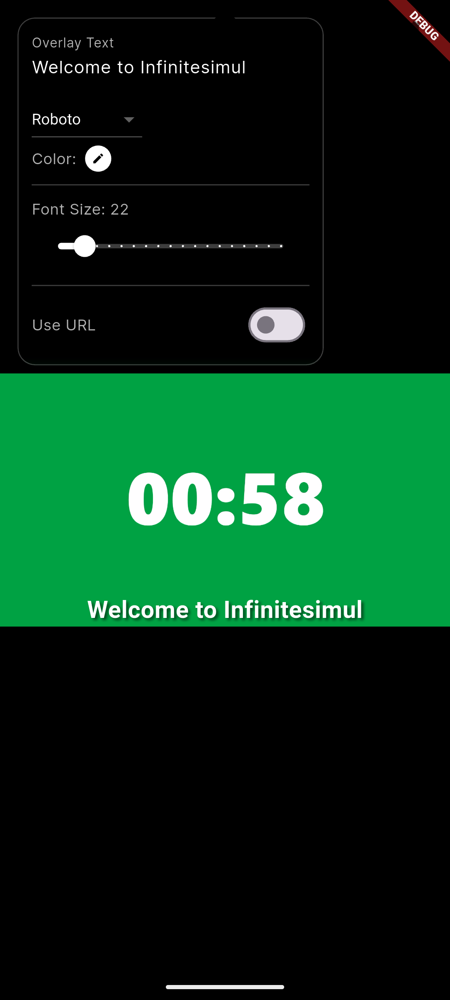
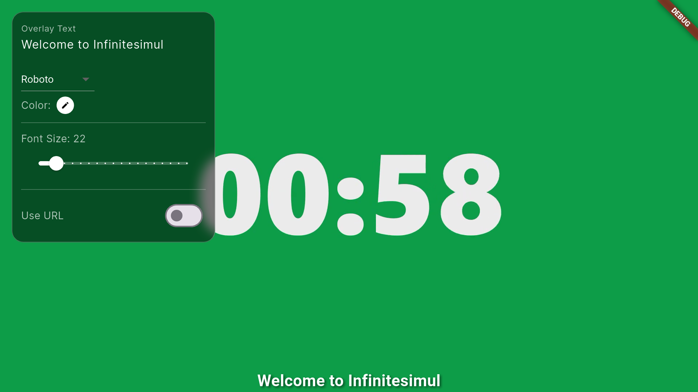
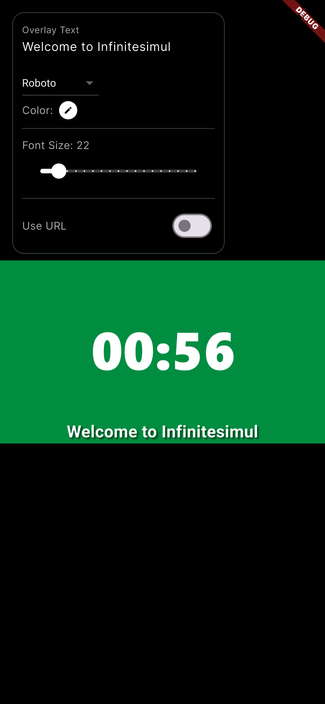

# Flutter App Development Test

## Overview
This project is a one-page Flutter application developed for the **Flutter App Development Test for Qualified Candidates**.  
The app demonstrates video playback functionality with a text overlay, optimized for responsiveness and compatibility across devices including **mobile phones**, **tablets**, and **Android TVs**.

---

## 🧱 Tech Stack

- **Flutter**: 3.35.6  
- **Dart**: 3.9.2  

---

## ✨ Features

- 🎥 **Video Playback**
  - Automatically plays video on startup.
  - Uses `video_player` for smooth playback performance.
  - Supports Picture-in-Picture (PiP) mode when available.
  - Falls back to background playback on devices that do not support PiP.

- 🧭 **Responsive Layout**
  - Adapts seamlessly to different screen sizes and orientations.
  - Layout adjusts dynamically for TVs, tablets, and phones.

- 💬 **Text Overlay**
  - Displays an overlaid text component on top of the video.
  - The overlay remains visible and properly aligned across resolutions.

- 🖱️ **TV Remote Navigation**
  - Fully remote-controllable (remotable) for Android TV.
  - Proper focus traversal behavior (e.g., using arrow keys or D-Pad).

- 🧩 **Modular Code Structure**
  - Clean architecture with separated widgets and state management using Riverpod or BLoC.
  - Components like `FloatingPanelSection` are independently focusable and reusable.

---

## 📱 Platform Support

| Platform | Supported | Notes |
|-----------|------------|-------|
| Android Phone | ✅ | Fully tested |
| Android TV | ✅ | Remote focus navigation supported |
| iOS | ✅ | Basic playback supported |
| Web | ✅ | Responsive layout |
| Desktop | ⚙️ | Experimental support |

<p align="center">
  
  
  
  
</p>

---

## ⚙️ Installation

1. Clone this repository:
   ```bash
   git clone https://github.com/hansss18/vid_layer.git
   ```

2. Navigate into the project directory:
   ```bash
   cd vid_layer
   ```

3. Get the required dependencies:
   ```bash
   flutter pub get
   ```

4. Run the app:
   ```bash
   flutter run
   ```

---

## 🧠 Project Structure

```
lib/
├── gen/
│   └── assets.gen.dart
├── models/
│   └── home_config/
│       ├── home_config_model.dart
│       └── home_config_model.freezed.dart
├── states/
│   ├── actions/
│   └── stores/
│       └── home_config/
│           ├── home_config_notifier.dart
│           └── home_config_notifier.g.dart
├── views/
│   ├── screens/
│   │   └── home_screen.dart
│   └── sections/
│       ├── color_picker_dialog_section.dart
│       ├── floating_panel_section.dart
│       └── video_url_dialog_section.dart
├── app_theme.dart
└── main.dart
```

---

## 🧩 Core Components

### `FloatingPanelSection`
- A remotable widget that responds correctly to TV remote focus navigation.
- Allows moving focus between sliders, buttons, and color pickers.
- Handles D-Pad navigation without getting stuck on sliders.

### `VideoSection`
- Displays the main video using `video_player`.
- Handles Picture-in-Picture (PiP) or background playback fallback automatically.

---

## 🧪 Testing Notes

- Verify PiP functionality on Android 8.0+ devices.
- On devices not supporting PiP, video playback should continue in the background.
- Ensure D-Pad navigation allows switching focus between all interactive elements.

---

## 🧰 Dependencies

| Package | Usage |
|----------|--------|
| `video_player` | For video playback |
| `pip` | Picture-in-Picture mode |
| `flutter_riverpod` | State management |
| `google_fonts` | Custom typography |
| `material_design_icons_flutter` | Icons |

---

## 📄 License

This project is developed for evaluation purposes only and is not intended for commercial use.
